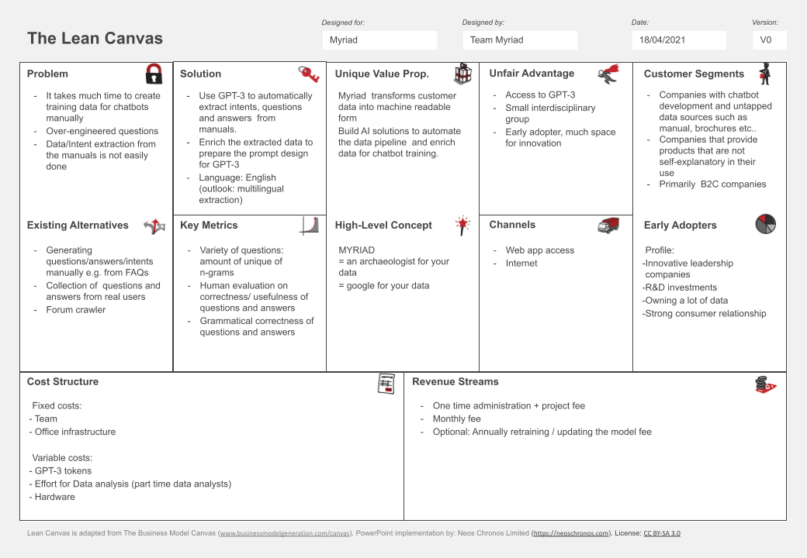

Myriad - Question Answer pair generator
=============

This is the result of a 48 hour run to write a gpt3 based text generation solution. The objective was to generate training data for chatbots based on companies (BSH in this makeathon) product user manuals. The objective was given to team MYRIAD in the context of TUM.ai's 2021 makeathon and the MYRIAD team was able to enter the finals with this approach.

The MYRIAD team consists of:

Kathy-Ann Heitmeier

Christian Hammacher

Miguel Â. Simões Valente

Robin Strohmeyer

Philipp Gawlik

Usage
------------

Run user manual text extraction with ``python extract_from_manual.py``

Run text based question answer pair generation with ``python text_based_generation_pipeline.py``

Run sentence based question answer pair generation with ``python sentence_based_generation_pipeline.py``

Canvas
------------

Tasks
----

1. Extract relevant data from xml
    a. Text that would be present in manual
    b. imagery/illustration belonging to the text
    c. distinguish btw. different products in xml
2. prompt engineering
3. Backend
4. Functions of front end
    a. upload xml, Intent | Query | Answer | ID option to approve or reject, export to DialogFlow (preferred) / LUIS/Ras
    b. feedback: give prefered answer
    c. your company logo here
    d. simple/advances config setting interface
    e. version of the model
5. Lean Business Model Canvas
6. Create/Formulate Business Case
    a. Outlook, big Picture, drop in any xml file. Summarize xml files.

Plan:

1. Analyse data
    a. is json/xml the same?
    b. in what form is the natural language data and how to get it?
    c. build a minimal example for the gpt3 prompt?
    d. any intents here?
    e. what products are there?
2. team up and try out gpt3 prompt ideas on minimal example
3. try to do minimal example of frontend (I)
4. evaluate different attempts
5. build pipeline
    a. extract data automatically
    b. build gpt3 api interface (upload data + prompt; retrieve question/answer/intend pairs)
    c. hand over data to frontend
6. format data to dialogflow
7. do presentation

Frontend
--------

[link text](https://www.youtube.com/watch?v=9bYt03_oxCA "Prototype")
